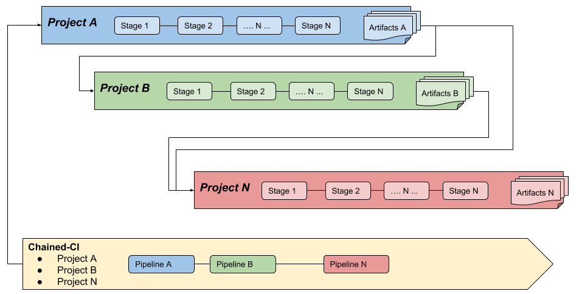
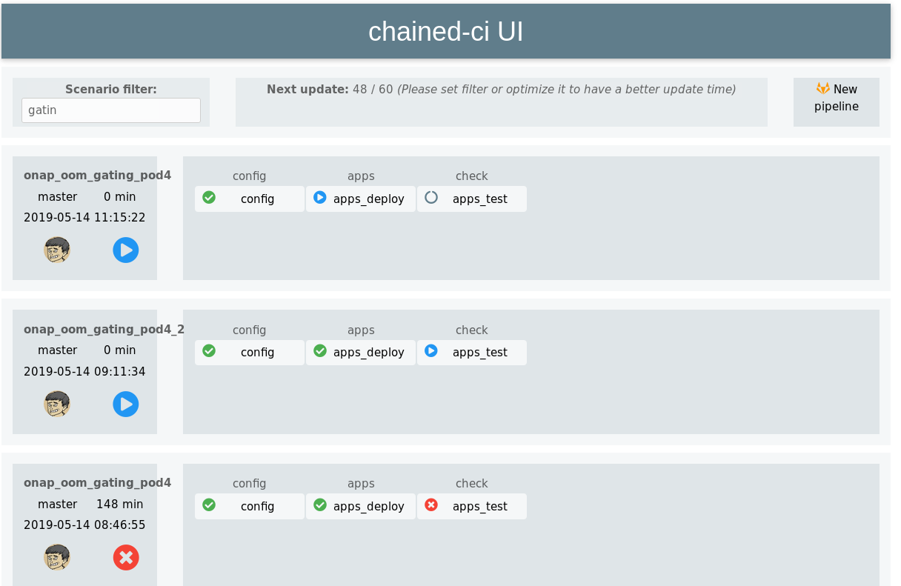

# Introduction to Chained-ci

Chained-ci is a solution to chain CI/CD pipelines from different gilab projects.
It leverages gitlab APIs and features like the artifacts.

As an example if you want to install a solution on an infrastructure, you can
chain the project pipeline in charge of infrastructure deployment then the
pipeline in charge of the deployment of the target solution thanks to
environment variables, configuration parameters provided as artifacts at the
end of the first pipeline.

Chained-ci offers additional possibilities such as using static artifacts,
notifying third parties.

## Why Chained-ci

Historically involved in several Open Source projects, it was very hard to
harmonize CI/CD strategies as each project had its own way to manage it and
automation culture.
OPNFV XCI initiative was created to provide a way to create links between CI/CD
teams of different Open Source Networking communities.

In parallel, internally we started having lots of projects on gitlab.
The goal was to be able to chain the pipelines of these different gitlab
projects. Each project remains responsible for its CI/CD strategy but may expose
artifacts and can be consumed by other projects.

Thanks to Chained-ci, it is possible to easily mix and match pipelines and unify
CI/CD strategy leveraging gitlab capabilities.

It is possible on the same infrastructure to automate the deployments and
testing of several projects in parallel.

## Chained-ci project

Chained-ci is composed of several sub-projects:

* [Chained-ci](https://gitlab.forge.orange-labs.fr/osons/chained-ci): the part
  where the chains will be created and configured
* [Chained-ci-roles](https://gitlab.com/Orange-OpenSource/lfn/ci_cd/chained-ci-roles):
  the repository hosting the ansible roles
* [Chained-ci-tools](https://gitlab.com/Orange-OpenSource/lfn/ci_cd/chained-ci-tools):
  some tooling to simplify the creation of the chains
* [Chained-ci-vue](https://gitlab.com/Orange-OpenSource/lfn/ci_cd/chained-ci-vue):
  a web front end to easily visualise the different chains.

If you click on any element of the chain, you will see the corresponding gitlab
pipeline. You can also restart the chain in case of failure at the step it
failed.

## Get started

* [DTs Chained-ci installation](chained-ci-install.md)
* [DTs Chained-ci pipelines](chained-ci-pipeline.md)
* [Orange: Create your Chained-ci](./user-guide/configure.md)
* [Orange: Run your Chained-ci](./user-guide/run.md)
* [Orange: Examples](./example/example.md)
