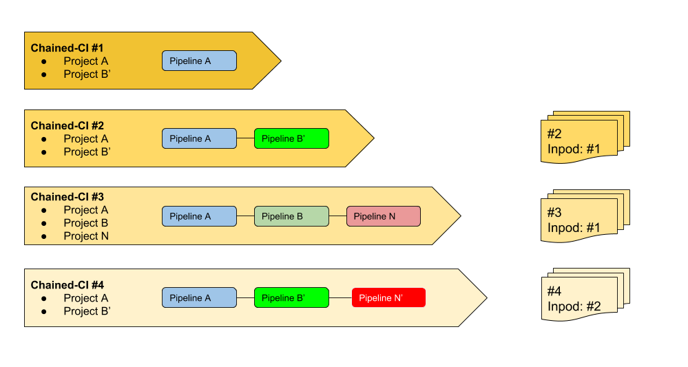

# Create your chain

You must clone the chained-ci project.

```Shell
   git clone https://gitlab.forge.orange-labs.fr/osons/chained-ci
   cd chained-ci
   git submodule init
   git submodule update
```

The chained-ci repository can be shown as follows:

```Ascii
.
├── pod_inventory
│   ├── group_vars
│   │   └── all.yml
│   ├── host_vars
│   │   ├── existing_chained.yml
│   │   ├── ...
│   │   └── vpod1.yml
│   └── inventory
└── roles
    ├── artifact_init
    │   ├── defaults
    │   └── tasks
    ├── get_artifacts
    │   ├── defaults
    │   └── tasks
    ├── gitlab-ci-generator
    │   ├── tasks
    │   └── templates
    ├── run-ci
    │   └── tasks
    └── trigger_myself
        └── tasks
```

The ansible roles are retrieved through the git submodules.

Note: It is recommended to create your branch to create your new chain.

To create you chained-ci chain

* Edit  the **pod_inventory/inventory** file to declare your chain
* Create a file in **pod_inventory/host_vars** to configure your chain
* Edit **pod_inventory/group_vars/all.yaml** to reference some variables if
  needed

## Declare your chain

You must first declare your chain name in the pod_inventory/inventory file.
Edit the file and add your chain name at the end of the file.
The chain name shall be self-explicit.

Even if the naming is free, it is recommended to follow the syntax:

`[target][_[infra]]_[[ci_option]]_[pod]]`

e.g.

* `pod2`: deployment of the pod2 infrastructure (GNU/Linux OS)
* `acumos_pod4`: deployment of acumos on POD4
* `functest_pod4`: run functest tests on POD4
* `k8s_pod1`: deployment of kubernetes on bare metal on pod1
* ...
* `onap_k8s_daily_pod4`: daily deployment of onap on k8s infra installed on pod4

## Define your chain

The second step consists in creating the ansible role for the new chain.

Create a file in pod_inventory/host_vars.

The file name shall correspond to the chain name you declared in the inventory
file e.g. acumos_pod4.yaml.

This file describes the chain. It reference the different projects you want to
chain, indicating the expected artifacts to be re-used from one project to
another.

```YAML
---
jumphost:
  server: <target POD jumphost IP>
  user: <ansible user>
[option section]
scenario_steps:
  step 1:
  ...
  step 2:
  ...
  step N:
  ...
```

The chain will be run sequentially (e.g. config then step 1 until step N).
Each pipeline can however parallelize some stages.

The option section is not mandatory.

### jumphost Definition

A jumphost is associated to a chained-ci even if the different steps can be
performed through projects hosted in different environements (public gitlab.com
and internal gitlab). The creator of the chain shall ensure that the projects
can be invoked from the referenced jumphost.

### Chained-ci options

The possible option fields are:

* environment: this parameter is used and propagated as an environment variable
  to all the projects involved in the chained-ci
* longlife_artifact: `true` (not present by default)
* inpod: `<other_chained_ci_reference>`
* healthchecks_id: `<uid>`

#### longlife_artifact

The longlife_artifact option is needed to store the artifacts over a long
period. As other chains may consume the artifacts, if the chained-ci is not run
frequently, the artifacts could be deleted after a while and become unavailable
for other chained-ci.

Typically if you install an infrastructure once and run several chains
requesting the artifacts of the infrastructure installation, it makes sense to
set this option.

#### inpod

Chained-ci can be seen as matriochka, in fact you may trigger deployments once
a previous deployment has been completed.

The inpod parameter allows to define a sort of heritage in the chained-ci
declaration.



#### healthchecks

The healthcheck option is used to reference your chained-ci to
[healthcheck](https://github.com/healthchecks/healthchecks).

### Chained-ci steps

Each step can be defined as follow:

```YAML
[step name]:
  project: [gitlab project reference]
  get_artifacts:
    - name: [project name for the artifact]
      [static_src: true]
  [extra parameters]
  [infra]
```

#### gitlab project reference (mandatory)

It shall correspond to a name of a gitlab project.

#### get_artifacts (optional)

The get_artifacts is to retrieved data (env variables, configuration files)
from a previous gitlab pipeline from a chained-ci.

These artifacts can be retrieved:

* dynamically (by Default): gitlab API will be called to retrieved the last
  artifacts corresponding to the project referenced
* statically: if static_src parameter is set to True, you then must indicate
  the path to the artifact

By default Chained-ci will call gitlab APIs to retrieved the artifact.

##### limit_to

Please note that it is possible to retrieve only a subset of the files from
an artifact by using **limit_to**.

```YAML
get_artifacts:
      - name: infra_deploy
        limit_to:
          - vars/user_cloud.yml: vars/user_cloud.yml
```

##### in_pipeline=false

It is also possible to indicate that the artifact cannot be retrieved from the
pipeline by setting in_pipeline=false in the get_artifact section. You then
have to add the name of the pipeline to fetch and the step in the pipeline.

In the example, we retrieve artifacts from `config` step of last
`onap_k8s_ic_pod4` pipeline.

```YAML
 get_artifacts:
      - name: config:onap_k8s_ic_pod4
        in_pipeline: false
        limit_to:
          - vars/pdf.yml: vars/pdf.yml
          - vars/idf.yml: vars/idf.yml
```

#### extra parameters (optional)

You may indicate here additional variables to configure your Chained-ci. These
variables will be given as environment variables for the run of the project. It
shall be configured as follows:

```YAML
extra_parameters:
      key 1: value 1
      key 2: value 2
      ....
      key N: value N
```

#### infra (optional)

This option can be specified if you want to use a specific resources of an
existing infra. This infra shall be declared in the Infrastructure Description
file.

## Create your static artifacts

It is possible to create a static artifact file. It consists in a zip file
containing all the files.

For instance if you need to precise an inventory my_jumhost and a set of
vaiables declared in a foo.yml file, you will need to prepare your file.

```
├── inventory
│   └── my_jumphost
└── vars
    └── foo.yml
```

Zip the different files in my_foo.zip and reference zoo in the chained-ci.

```
get_artifacts:
  - name: my_foo
    static_src: true
```

Note that my_foo must not be in the path once the archive unzipped.

## Gitlab-ci generator

The `.gitlab-ci.yml` of your Chaine-ci project may be a little be tricky to
generate. That is why a gitlab-ci generator has been introduced.

You can run the gitlab-ci-generator ansible role locally on your machine.
Based on the chained-ci you created, it will re-generate the file properly.

```Shell
ansible-playbook -i ./pod_inventory/inventory ./gitlab-ci-generator.yml
```

`<chain_id>` is the name of the chain you defined in *Declare your chain* step

once you have generated `.gitlab-ci.yml`, you'll need to push your change to the
gitlab server (via a merge request or not, depending on you push policy) before
using it.

## chained-ci tools

It provides a set of tools to deal with Chained-ci:

* Get artifacts from a projects
* set the configuration (ssh key and ssh config)
* Generate Vault key file

See [README](https://gitlab.com/Orange-OpenSource/lfn/ci_cd/chained-ci-tools)
for details.
