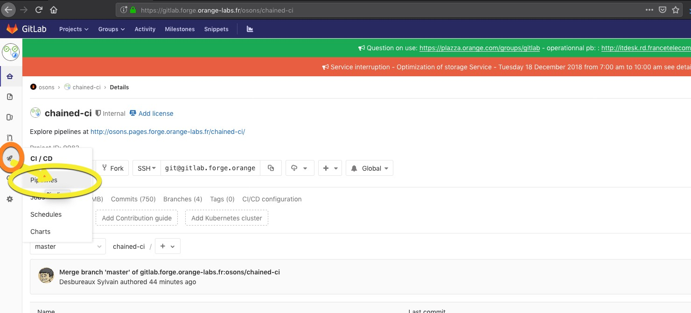
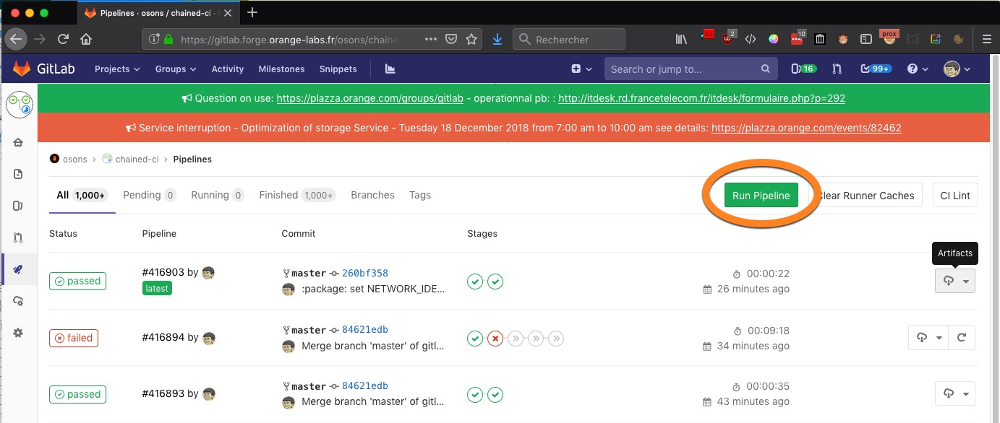
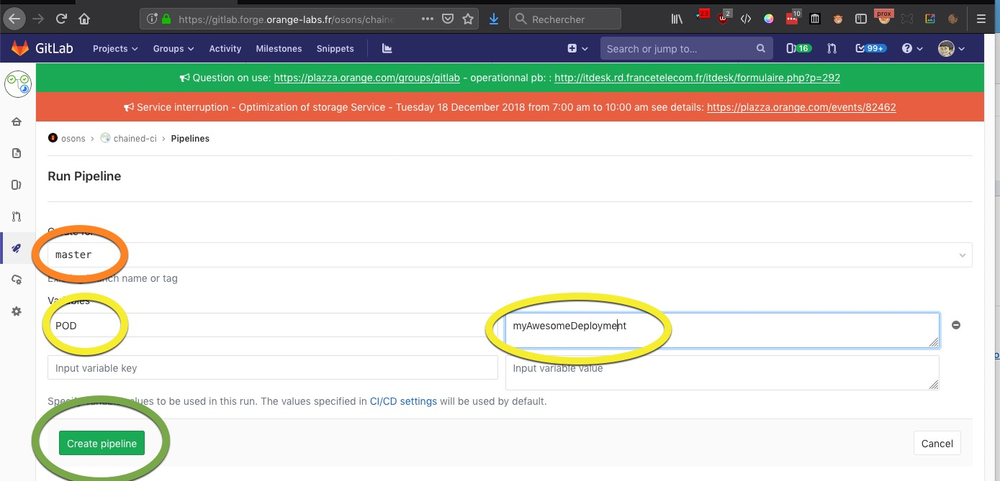
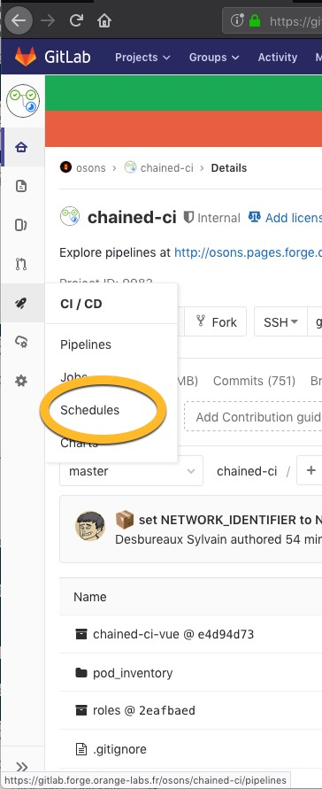
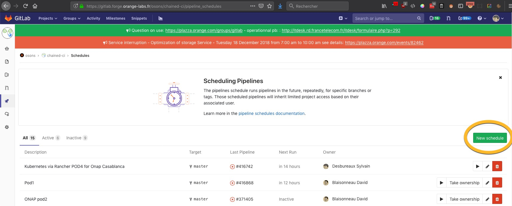
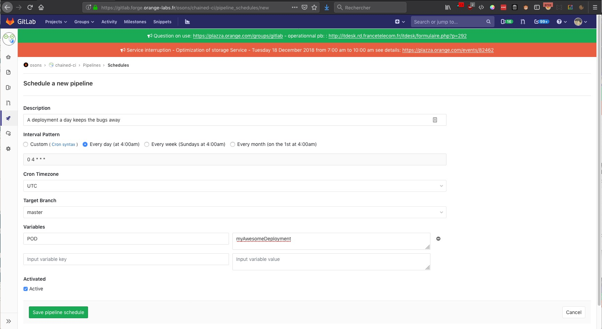

# Run your Chained-ci

From the gitlab web page of your Chained-ci project, select the CI/CD menu

* Click on the Run Pipeline button

  

* Select the acurate branch (Default: master) (orange in image)

  

* set variable POD, here POD is the identifier for your chained-CI (yellow in image)

  

* Click on Create pipeline i(green in image)

  

You can obviously also use the Schedules menu if you want to regularly run
your chain (cronjob defined).

